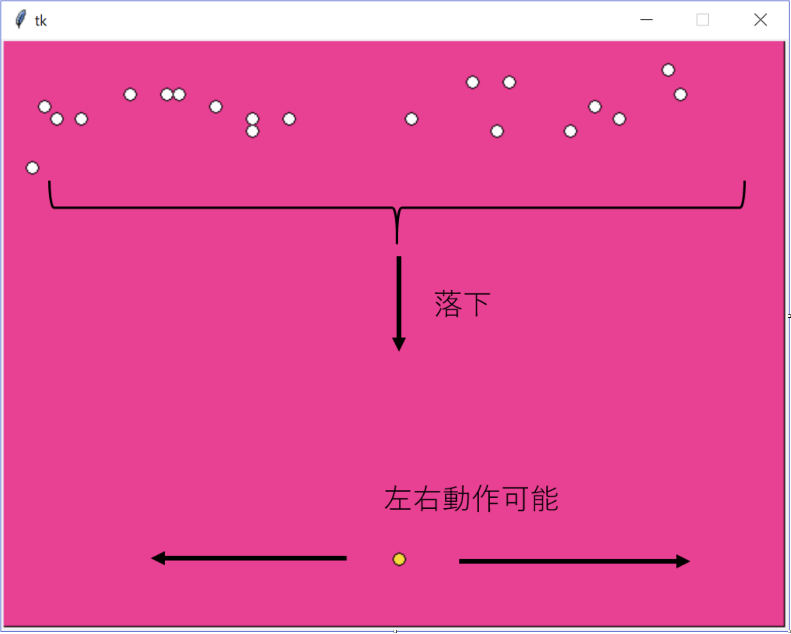
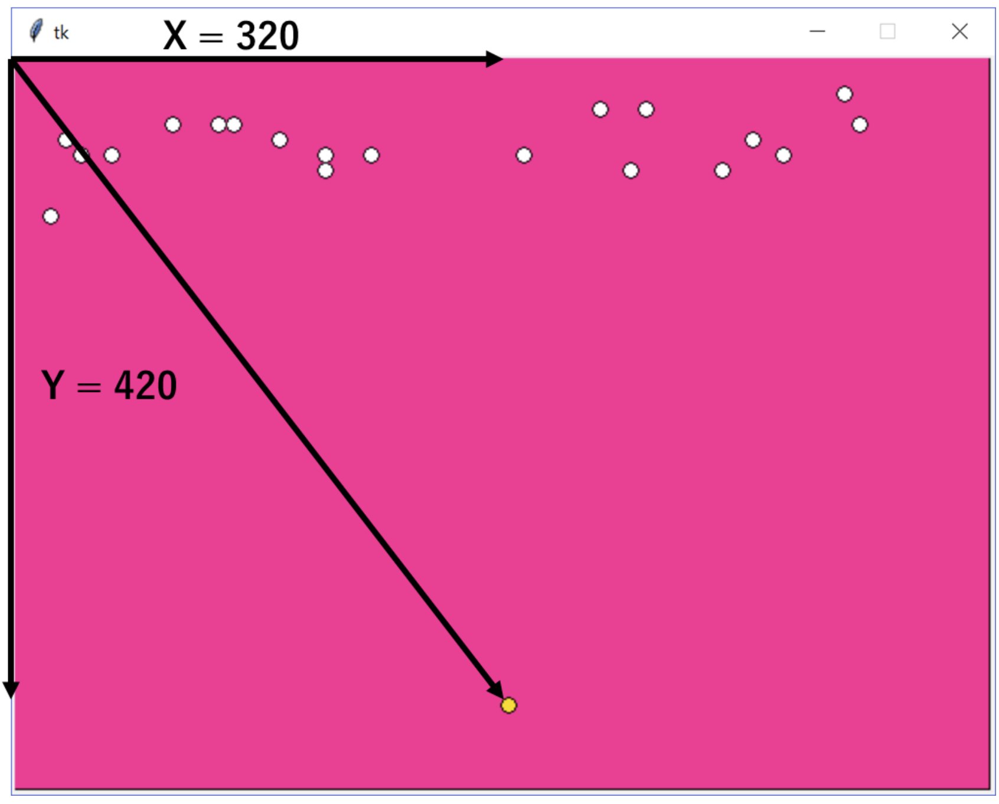

# SnowGame
Python勉強したての頃に頑張って作ったクソゲー

# 概要
回避型のアクションゲーム。
黄色玉が操作対象で、十字キーで左右に動作でき上から落ちてくる白玉を回避する。ラウンドは３まであり、全て回避するとことでゲームクリア。
白玉に当たるとゲームオーバーとなる。




# 操作方法
十字キーで左右に移動する。

# インストール方法
## 1. tkinterのインストール
tkinterが必要です。tkinterのインストール方法は以下の通りです。
tkinterはPythonの標準ライブラリなので、もしかしたら既にインストールされているかもしれません。ですので、まずはこの手順を飛ばしてください。エラーが出たらインストールをお願いします。
- Windows: [こちら](https://and-engineer.com/articles/YWjayhIAACEAEjeC)
- Mac: [こちら](#tkinterのインストール方法macos)

## 2. ゲームのダウンロード
コマンドプロンプトもしくはターミナルを開いて、以下のコマンドを実行してください。[こちらからダウンロードしても構いません。](https://github.com/Masa-Ryu/SnowGame)
```bash
git clone https://github.com/Masa-Ryu/SnowGame.git
```

```bash
cd SnowGame
```

## 2. ゲームの実行
windowsの場合：
```bash
python src/game.py
```
Macの場合：

まず最初にDockerをインストールしてください。
次にdockerコマンドを実行します。Python環境を揃えます。
```bash
docker build -t tkinter-app .
```
最後に、Dockerコンテナを実行します。ゲームが起動します。
```bash
docker run -d -v /tmp/.X11-unix:/tmp/.X11-unix -e DISPLAY=unix$DISPLAY tkinter-app
```

# tkinterのインストール方法(MacOS)
## 1. Homebrewをインストールする
Googleで検索して、インストールしてください。
## 2. xquartzをインストールする
Terminalを開いて下記コマンドを実行。
```bash
brew install --cask xquartz
```
## 3. XQuartzの設定
- インストール後、XQuartzを起動します（アプリケーションフォルダからXQuartzを探すか、Spotlight検索で見つけることができます）。
- XQuartzメニューからPreferencesを開きます。
- Securityタブに移動し、「Allow connections from network clients」のチェックボックスをオンにします。
- これらの変更を有効にするために、PCを再起動します。

## 4. X11のアクセス許可の設定
- ターミナルを開き、以下のコマンドを実行します。
```bash
xhost +
```
`access control disabled, clients can connect from any host`
と表示されればOKです。

これで、Dockerコンテナ内のTkinterアプリケーションをMacのディスプレイで実行できるようになります。

:warning: セキュリティ上の理由から、ゲームをやらなくなったら下記コマンドを実行して、接続許可を解除してください。
```
xhost -
```

# プログラムの構成

## 画面の構成
左上を座標(0,0)として、右方向をx軸、下方向をy軸としています。


